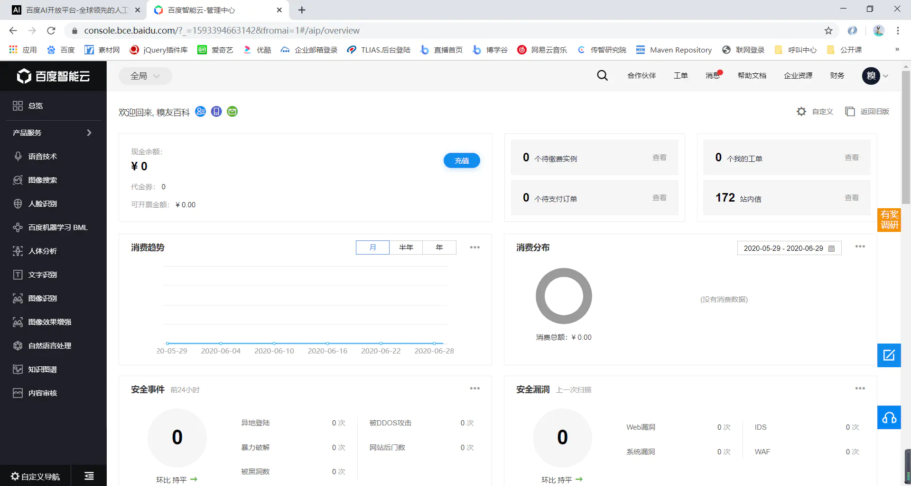
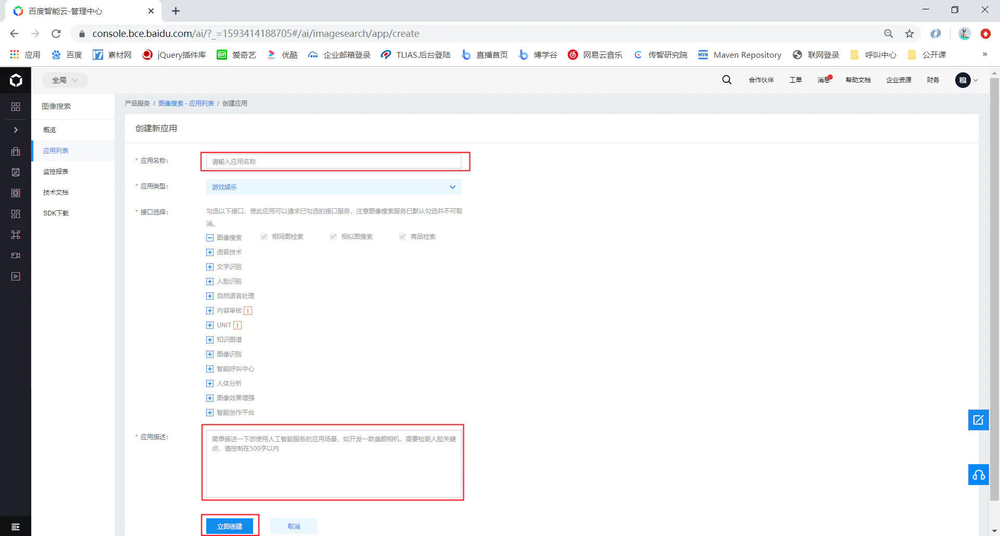

# 百度AI-语音识别&图片搜索

## 准备工作

1）在浏览器输入[https://ai.baidu.com/](https://ai.baidu.com/ ) 打开`Baidu大脑|AI开发平台首页`


2）点击右上角`控制台`，进入用户注册登录界面


3）如果没有百度账号，可以先注册然后再进行登录；如果已经有了百度账号可以直接登录；登录成功后，进入控制台管理界面



4）进行实名认证（因百度AI有些功能需要用户实名认证才可使用，所以在这提前进行实名认证）


5）点击实名认证按钮进入实名认证页面（因我的账号已经进行过初级实名认证，实名认证内容大家按照提示进行即可）


到此准备工作结束，可以使用`百度AI开发平台`提供的API进行开发了

## 语音识别

### 第一步：左侧菜单选择`语音技术`


### 第二步：语音识别主界面点击`创建应用`


### 第三步：创建应用填写应用信息


### 第四步：创建成功后进入应用列表查看


### 第五步：点击上图左侧菜单`技术文档`
https://cloud.baidu.com/doc/SPEECH/index.html


### 第六步：按照下图打开语音快速入门文档


### 第七步：阅读文档进行开发并调试

1）创建一个测试工程

​	speech_imageseach

2）根据API提示，导入百度AI所需依赖包

```xml
<!--百度AI依赖包-->
<dependency>
    <groupId>com.baidu.aip</groupId>
    <artifactId>java-sdk</artifactId>
    <version>4.12.0</version>
</dependency>
```

3）编写测试代码

```java
/**
 * @Auth: zhuan
 * @Desc: 百度AI-语音识别、语音合成测试类
 * @DateTime: 2020/6/29 11:14
 */
public class SpeechTest{
    
    //设置APPID/AK/SK
    public static final String APP_ID = "20616557";
    public static final String API_KEY = "YlvktyOpTrc7eOxqMQGUEAjM";
    public static final String SECRET_KEY = "EnAoDcoiBSqxRQp69bTKB3xBwZbGpOVR";
    /**
     * 功能描述:  语音识别
     * @return : void
     */
    @Test
    public void speechRecognition() throws JSONException {
        // 初始化一个AipSpeech
        AipSpeech client = new AipSpeech(APP_ID, API_KEY, SECRET_KEY);

        // 可选：设置网络连接参数
        client.setConnectionTimeoutInMillis(2000);
        client.setSocketTimeoutInMillis(60000);

        // 可选：设置代理服务器地址, http和socket二选一，或者均不设置
        //client.setHttpProxy("proxy_host", proxy_port);  // 设置http代理
        //client.setSocketProxy("proxy_host", proxy_port);  // 设置socket代理

        // 可选：设置log4j日志输出格式，若不设置，则使用默认配置
        // 也可以直接通过jvm启动参数设置此环境变量
        //System.setProperty("aip.log4j.conf", "path/to/your/log4j.properties");

        // 调用接口
        JSONObject res = client.asr("E:/public/16k-23850.amr", "amr", 16000, null);
        System.out.println(res.toString(2));

    }
}
```

4）下载官网提供测试音频文件（也可以使用语音合成，自己使用`语音合成`接口合成语音文件）


5）测试结果


## 语音合成

> `语音技术`已经包含了`语音合成`，但是`语音合成`免费次数需要我们手动领取才可以，下面我们使用语音合成来合成语音文件完成语音识别测试。

### 一、点击`语音技术`页面右上角`管理控制台`


### 二、在管理控制台进入`语音技术`主页


### 三、语音技术主页选择`概览`-->`语音合成`


### 四、领取`语音合成`免费次数


### 五、点击`技术文档`进入语音技术API页面


### 六、按照下图打开`语音合成API`文档


### 七、阅读文档进行开发并调试

1）在语音识别创建的speech_imageseach直接开发即可，它们所需环境都是一致的

```shell
1）所需jar包一致，不需要重新导入
2）所需APP_ID、API_KEY、SECRET_KEY一致不需要重新填写
```

2）编写测试代码

```java
//直接在SpeechTest测试类中添加如下测试方法即可
@Test
public void speechSynthesis() throws JSONException{
    // 初始化一个AipSpeech
    AipSpeech client = new AipSpeech(APP_ID, API_KEY, SECRET_KEY);
    // 可选：设置网络连接参数
    client.setConnectionTimeoutInMillis(2000);
    client.setSocketTimeoutInMillis(60000);
    // 可选：设置代理服务器地址, http和socket二选一，或者均不设置
    //client.setHttpProxy("proxy_host", proxy_port);  // 设置http代理
    //client.setSocketProxy("proxy_host", proxy_port);  // 设置socket代理
    // 可选：设置log4j日志输出格式，若不设置，则使用默认配置
    // 也可以直接通过jvm启动参数设置此环境变量
    //System.setProperty("aip.log4j.conf", "path/to/your/log4j.properties");
    // 调用接口
    TtsResponse res = client.synthesis("你好传智", "zh", 1, null);
    byte[] data = res.getData();
    JSONObject res1 = res.getResult();
    if (data != null) {
        try {
            Util.writeBytesToFileSystem(data, "E:/ai-speech/itcast.mp3");
        } catch (IOException e) {
            e.printStackTrace();
        }
    }
    if (res1 != null) {
        System.out.println(res1.toString(2));
    }
}
```

3）测试结果

> *代码测试返回结果*


> *生成的音频文件*


### 注意

```shell
使用`语音识别`，`语音合成`如果出现错误，根据错误code参考以下链接解决:
	`语音识别`: https://cloud.baidu.com/doc/SPEECH/s/Yk4o0bkop
	`语音合成`: https://cloud.baidu.com/doc/SPEECH/s/jk4nlz520
```

## 图片搜索

### （1）控制台主页左侧菜单选择`图像搜索`


### （2）图像搜索主界面点击`创建应用`


### （3）创建应用填写应用信息



### （4）创建成功后进入应用列表查看


### （5） 点击“应用名称”进入应用详情页面


### （6）申请建库


 

### （7）建库成功后，导入图片

首先，选择要导入的图库，点击`管理图库`按钮


然后，上传图片并设置`摘要`信息


### （8）点击左侧`技术文档`进入技术文档

### （9）阅读文档进行开发并调试

1）创建一个测试工程（*因工程已经存在可以直接在speech_imageseach工程中测试即可*）

2）根据API提示，导入百度AI所需依赖包（*包也已经存在可以不用再次导入*）

```xml
 <!--百度AI依赖包-->
<dependency>
    <groupId>com.baidu.aip</groupId>
    <artifactId>java-sdk</artifactId>
    <version>4.12.0</version>
</dependency>
```

3）编写测试代码

```java
/**
 * @Auth: zhuan
 * @Desc: 百度AI-图片搜索测试类
 * @DateTime: 2020/6/29 11:24
 */
public class ImageSearchTest{
    
    //设置APPID/AK/SK
    public static final String APP_ID = "20617129";
    public static final String API_KEY = "O7SBMGthGxQd3rQkPIgGswdk";
    public static final String SECRET_KEY = "ApDvY5WN1Twsj1DAZADAdFxSZF8l7qt6";
    /**
 	 * 功能描述:  百度AI-图片搜索
 	 * @return : void
 	 */
    @Test
    public void isearch() throws JSONException {
        AipSpeech client = new AipSpeech(APP_ID, API_KEY, SECRET_KEY);
        // 可选：设置网络连接参数
        client.setConnectionTimeoutInMillis(2000);
        client.setSocketTimeoutInMillis(60000);

        // 可选：设置代理服务器地址, http和socket二选一，或者均不设置
        //client.setHttpProxy("proxy_host", proxy_port);  // 设置http代理
        //client.setSocketProxy("proxy_host", proxy_port);  // 设置socket代理

        // 可选：设置log4j日志输出格式，若不设置，则使用默认配置
        // 也可以直接通过jvm启动参数设置此环境变量
        //System.setProperty("aip.log4j.conf", "path/to/your/log4j.properties");

        // 调用接口
        //String path = "E:\\python_baidu_img/\huaweiP40.jpg";
        //String path = "E:\\python_baidu_img/\huaweiNova7.jpg";
        String path = "E:\\python_baidu_img/\lianxiangM4000s.jpg";
        JSONObject res = client.productSearch(path, new HashMap<String, String>());
        System.out.println(res.toString(2));
    }
}
```

4）测试结果


### 注意

```shell
1、检索接口不返回原图，仅反馈入库时填写的brief信息，请调用入库接口时尽量填写可关联至本地图库的图片id或者图片url等信息。
2、检索接口默认返回TOP 300的结果，如果图库里不满300张图片，会返回所有图片，请入库足量图片以便充分测试效果。
3、原则上任何2张图片都有相似度，只不过分值有高低，应用时可结合接口返回的相关性分数score（取值范围0-1，越接近1代表相似度越高）进行筛选，如选取score大于某个值的结果进行应用。
```

## 语音识别成功案例(DIY)

完成代码

```python
from pydub import AudioSegment
from pydub.silence import split_on_silence
from aip import AipSpeech

# 百度验证部分
APP_ID = '22943320'
API_KEY = 'GTirLMQOxCymlSQTbrdjGivk'
SECRET_KEY = 'ICylOI366CyLNyivgIw0rmNvbQp8eZxl'
client = AipSpeech(APP_ID, API_KEY, SECRET_KEY)

# 读取音频 预处理
sound = AudioSegment.from_wav('/Users/lilizhao/Downloads/229376551-1-208.wav')
sound = sound.set_frame_rate(16000)
sound = sound.set_channels(1)

# 切割音频
min_silence_len = 700
silence_thresh = -32
chunks = split_on_silence(sound, min_silence_len, silence_thresh)
print(len(chunks))

# pieces, start_t, end_t = split_on_silence(sound, min_silence_len, silence_thresh)
silent = AudioSegment.silent(duration=1000)

# 将音频转换为wav
def spit2mp3():
    for inx, chunk in enumerate(chunks):
        chunk.export("/Users/lilizhao/Downloads/%d.wav" % inx, format="wav")

def ms2s(ms):
    mspart = ms % 1000
    mspart = str(mspart).zfill(3)
    spart = (ms // 1000) % 60
    spart = str(spart).zfill(2)
    mpart = (ms // 1000) // 60
    mpart = str(mpart).zfill(2)

    # srt的时间格式
    stype = "00:" + mpart + ":" + spart + "," + mspart
    return stype


# 读取切割后的文件
def get_file_content(filePath):
    with open(filePath, 'rb') as fp:
        return fp.read()


# 语音识别
def audio2text(wavsample):
    rejson = client.asr(wavsample, 'wav', 16000, {'lan': 'zh'})
    if (rejson['err_no'] == 0):
        result = rejson['result'][0]
    else:
        result = "erro" + str(rejson['err_no'])
    return result


# 输出字幕
# def text2str(inx, text, starttime, endtime):
#     strtext = str(inx) + '\n' + ms2s(starttime) + ' --> ' + ms2s(endtime) + '\n' + text + '\n' + '\n'
#     return strtext


# 读写文件
def strtxt(text):
    with open('/Users/lilizhao/Downloads/yo.txt', 'a') as fp:
        fp.write(text)
        fp.close()

# main
if __name__ == '__main__':
    spit2mp3()
    for inx, val in enumerate(chunks):
        wav = get_file_content('/Users/lilizhao/Downloads/%d.wav' % inx)
        text = audio2text(wav)
        print(text)
```


