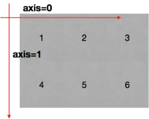
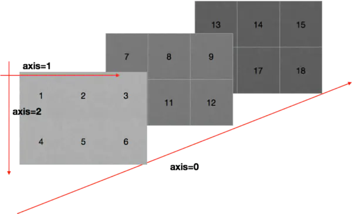

numpy 入门篇
##################################################################################

什么是 numpy
**********************************************************************************

为什么要学习 numpy
==================================================================================

	| 快速
	| 方便
	| 科学计算的基础库

numpy 是什么
==================================================================================

一个在 Python 中做科学计算的基础库，重在数值计算，也是大部分 PYTHON 科学计算库的基础库，多用于在大型、多维数组上执行数值运算。

numpy 基础
**********************************************************************************

numpy 创建数组(矩阵)
==================================================================================

.. code-block:: python

	# 创建数组
	import numpy as np

	a = np.array([1,2,3,4,5])
	b = np.array(range(1,6))
	c = np.arange(1,6)
	print(a)
	print(b)
	print(c)

	# [1 2 3 4 5]
	# [1 2 3 4 5]
	# [1 2 3 4 5]

	# 上面 a,b,c, 内容相同, 注意 arange 和 range 的区别

	# 数组的类名
	a = np.array([1,2,3,4,5])
	type(a)
	# ---> numpy.ndarray

	# 数据的类型
	print(a.dtype)
	# ---> int64

numpy 中常见的更多数据类型
==================================================================================

	| 类型 类型代码 说明
	| int8、uint8 i1、u1 有符号和无符号8位整型（1字节）
	| int16、uint16 i2、u2 有符号和无符号16位整型（2字节）
	| int32、uint32 i4、u4 有符号和无符号32位整型（4字节）
	| int64、uint64 i8、u8 有符号和无符号64位整型（8字节）
	| float16 f2 半精度浮点数
	| float32 f4、f 单精度浮点数
	| float64 f8、d 双精度浮点数
	| float128 f16、g 扩展精度浮点数
	| complex64 c8 分别用两个32位表示的复数
	| complex128 c16 分别用两个64位表示的复数
	| complex256 c32 分别用两个128位表示的复数
	| bool b 布尔型
	| object O python对象
	| string Sn 固定长度字符串，每个字符1字节，如S10
	| unicode Un 固定长度Unicode，字节数由系统决定，如U10

数据类型的操作
==================================================================================

.. code-block:: python

	# 指定创建的数组的数据类型
	a = np.array([1,0,1,0],dtype=bool) # 或者使用 dtype='?'
	print(a)

	# ---> [ True False  True False]

	# 指定创建的数组的数据类型
	a = np.array([1,0,1,0],dtype=bool) # 或者使用 dtype='?'
	print(a)
	# ---> [ True False  True False]

	# 修改数组的数据类型
	b = a.astype("i1")
	print(b)
	# --> [1 0 1 0]

	# 或者使用 a.asType(np.int8)
	c = a.astype(np.int8)
	print(c)
	# --> [1 0 1 0]

	# 修改浮点型的小数位数
	#numpy中的小数
	t7 = np.array([random.random() for i in range(10)])
	print(t7)
	print(t7.dtype)

	t8 = np.round(t7,2)
	print(t8)

	# [0.23509756 0.18365565 0.42878215 0.17844451 0.28498626 0.03637158
	#  0.81981437 0.51776255 0.74482902 0.91590774]
	# float64
	# [0.24 0.18 0.43 0.18 0.28 0.04 0.82 0.52 0.74 0.92] 

.. tip::

	综合案例

	.. code-block:: python

		# coding=utf-8
		import numpy as np
		import random

		#使用numpy生成数组,得到ndarray的类型
		t1 = np.array([1,2,3,])
		print(t1)
		print(type(t1))

		t2 = np.array(range(10))
		print(t2)
		print(type(t2))

		t3 = np.arange(4,10,2)
		print(t3)
		print(type(t3))

		print(t3.dtype)
		print("*"*100)
		#numpy中的数据类型

		t4 = np.array(range(1,4),dtype="i1")
		print(t4)
		print(t4.dtype)

		##numpy中的bool类型
		t5 = np.array([1,1,0,1,0,0],dtype=bool)
		print(t5)
		print(t5.dtype)

		#调整数据类型
		t6 = t5.astype("int8")
		print(t6)
		print(t6.dtype)

		#numpy中的小数
		t7 = np.array([random.random() for i in range(10)])
		print(t7)
		print(t7.dtype)

		t8 = np.round(t7,2)
		print(t8)

数组的形状
==================================================================================

.. code-block:: python

	a = np.array([[3,4,5,6,7,8],[4,5,6,7,8,9]])
	print(a)
	# [[3 4 5 6 7 8]
	#  [4 5 6 7 8 9]]

	# 查看数组的形状
	print(a.shape)
	# (2, 6)

	# 修改数组的形状
	print(a.reshape(3,4))
	# [[3 4 5 6]
	#  [7 8 4 5]
	#  [6 7 8 9]]

	print(a.shape)
	# (2, 6) a 的形状没有改变

	b = a.reshape(3,4)
	print(b.shape)
	# (3, 4)
	print(b)
	# [[3 4 5 6]
	#  [7 8 4 5]
	#  [6 7 8 9]]

	# 把数组转化为 1 维度数据
	c = b.reshape(1,12)
	print(c)
	# [[3 4 5 6 7 8 4 5 6 7 8 9]]  # 这是一维度数组吗？

	print(b.flatten())
	# [3 4 5 6 7 8 4 5 6 7 8 9]

数组和数的计算
==================================================================================

.. code-block:: python

	a = np.array([[3,4,5,6,7,8],[4,5,6,7,8,9]])
	print(a)
	# [[3 4 5 6 7 8]
	#  [4 5 6 7 8 9]]

	print(a+1)
	# [[ 4  5  6  7  8  9]
	#  [ 5  6  7  8  9 10]]

	print(a*3)
	# [[ 9 12 15 18 21 24]
	#  [12 15 18 21 24 27]]

	# 这是一-个numpy的广播机制造成的,在运算过程中,加减乘除的值被广播到所有的元素上面

数组和数组的计算
==================================================================================

.. code-block:: python

	a = np.array([[3,4,5,6,7,8],[4,5,6,7,8,9]])
	print(a)
	# [[3 4 5 6 7 8]
	#  [4 5 6 7 8 9]]

	b = np.array([[21,22,23,24,25,26],[27,28,29,30,31,32]])
	print(b)
	# [[21 22 23 24 25 26]
	#  [27 28 29 30 31 32]]

	# 数组和数组的加减法
	print(a+b)
	# [[24 26 28 30 32 34]
	#  [31 33 35 37 39 41]]

	# 数组和数组的乘除法
	print(a*b)
	# [[ 63  88 115 144 175 208]
	#  [108 140 174 210 248 288]]

	c = np.array([[1,2,3,4],[5,6,7,8],[9,10,11,12]])
	print(c)
	# [[ 1  2  3  4]
	#  [ 5  6  7  8]
	#  [ 9 10 11 12]]

	print(a*c)
	# operands could not be broadcast together with shapes (2,6) (3,4)

	a = np.array([[3,4,5,6,7,8],[4,5,6,7,8,9]])
	print(a)
	# [[3 4 5 6 7 8]
	#  [4 5 6 7 8 9]]

	c = np.array([1,2,3,4,5,6])
	print(a-c)
	# [[2 2 2 2 2 2]
	#  [3 3 3 3 3 3]]

	print(a*c)
	# [[ 3  8 15 24 35 48]
	#  [ 4 10 18 28 40 54]]

	c = np.array([[1],[2]])
	print(c)
	# [[1]
	#  [2]]

	print(c+a)
	# [[ 4  5  6  7  8  9]
	#  [ 6  7  8  9 10 11]]

	print(a*c)
	# [[ 3  4  5  6  7  8]
	#  [ 8 10 12 14 16 18]]

	print(c*a)
	# [[ 3  4  5  6  7  8]
	#  [ 8 10 12 14 16 18]]

* 广播原则

如果两个数组的后缘维度(trailing dimension，即从末尾开始算起的维度]的轴长度相符或其中一方的长度为1，则认为它们是广播兼容的。广播会在缺失和(或)长度为1的维度上进行。

	| 怎么理解呢? 

		| 可以把维度指的是shape所对应的数字个数

	| 那么问题来了:

		| shape为(3,3,3)的数组能够和(3,2)的数组进行计算么?
		| shape为(3,3,2)的数组能够和(3,2)的数组进行计算么?

	| 有什么好处呢?

		| 举个例子:每列的数据减去列的平均值的结果

轴 (axis)
==================================================================================

在 numpy 中可以理解为方向,使用 0,1,2... 数字表示,对于一个一维数组,只有一个0轴,对于 2 维数组(shape(2,2)),有 0 轴和 1 轴,对于三维数组(shape(2,2, 3)),有 0,1,2 轴

有了轴的概念之后,我们计算会更加方便,比如计算一个 2 维数组的平均值,必须指定是计算哪个方向上面的数字的平均值

那么问题来了:

	| 在前面的知识,轴在哪里?
	| 回顾 np.arange(0,10).reshape((2,5)),reshpe中 2 表示 0 轴长度(包含数据的条数)为 2, 1 轴长度为 5, 2X5 一共 10 个数据

* 二维数组的轴

* 三维数组的轴

numpy 常用方法
**********************************************************************************

numpy 读取数据
==================================================================================

	| CSV:Comma-Separated Value,逗号分隔值文件
	| 显示：表格状态
	| 源文件：换行和逗号分隔行列的格式化文本,每一行的数据表示一条记录

由于 csv 便于展示,读取和写入,所以很多地方也是用 csv 的格式存储和传输中小型的数据, 会经常操作 csv 格式的文件,但是操作数据库中的数据也是很容易的实现的

	| np.loadtxt(fname,dtype=np.float,delimiter=None,skiprows=0,usecols=None,unpack=False)

参数说明

	| 参数         解释
	| frame       文件、字符串或产生器，可以是.gz或bz2压缩文件
	| dtype       数据类型，可选，CSV的字符串以什么数据类型读入数组中，默认np. float
	| delimiter   分隔字符串，默认是任何空格,改为逗号
	| skiprows    跳过前x行，- -般跳过第-行表头
	| usecols     读取指定的列，索引，元组类型。.
	| unpack      如果True,读入属性将分别写入不同数组变量，False 读入数据只写入一个数. 组变量，默认False

读取和存储数据
==================================================================================

现在这里有一个英国和美国各自youtube1000多个视频的点击,喜欢,不喜欢,评论数量(["views","likes","dislikes","comment_total"])的csv,运用刚刚所学习的只是,我们尝试来对其进行操作

数据来源: ``https://www.kaggle.com/datasnaek/youtube/data``

	| np.loadtxt(US_video_data_numbers_path,delimiter=",",dtype=int,unpack=1)

注意其中添加 delimiter 和 dtype 以及 unpack 的效果

	| delimiter :指定边界符号是什么，不指定会导致每行数据为一个整体的字符串而报错
	| dtype :默认情况下对于较大的数据会将其变为科学计数的方式
	| upack :默认是Flase(0),默认情况下，有多少条数据,就会有多少行为True(1)的情况下,每-列的数据会组成-行,原始数据有多少列,加载出来的数据就会有多少行,相当于转置的效果

* 结合之前的所学的 matplotlib 把英国和美国的数据呈现出来

.. code-block:: python

	us_file_path = "./youtube_video_data/US_video_data_numbers.csv"
	uk_file_path = "./youtube_video_data/GB_video_data_numbers.csv"

	# t1 = np.loadtxt(us_file_path,delimiter=",",dtype="int",unpack=True)
	t2 = np.loadtxt(us_file_path,delimiter=",",dtype="int")

	# print(t1)
	print(t2)

转置
==================================================================================

转置是一种变换,对于 numpy 中的数组来说,就是在对角线方向交换数据,目的也是为了更方便的去处理数据

.. code-block:: python

	t = np.array([[0,1,2,3,4,5],[6,7,8,9,10,11],[12,13,14,15,16,17]])
	print(t)
	# [[ 0  1  2  3  4  5]
	#  [ 6  7  8  9 10 11]
	#  [12 13 14 15 16 17]]

	t1 = t.transpose()
	print(t1)
	# [[ 0  6 12]
	#  [ 1  7 13]
	#  [ 2  8 14]
	#  [ 3  9 15]
	#  [ 4 10 16]
	#  [ 5 11 17]]

	t2 = t.swapaxes(1,0)
	print(t2)
	# [[ 0  6 12]
	#  [ 1  7 13]
	#  [ 2  8 14]
	#  [ 3  9 15]
	#  [ 4 10 16]
	#  [ 5 11 17]]

	t3 = t.T
	print(t3)
	# [[ 0  6 12]
	#  [ 1  7 13]
	#  [ 2  8 14]
	#  [ 3  9 15]
	#  [ 4 10 16]
	#  [ 5 11 17]]

以上的三种方法都可以实现二维数组的转置的效果,转置和交换轴的效果一样

索引和切片
==================================================================================

对于刚刚加载出来的数据,我如果只想选择其中的某一列(行), 应该怎么做呢? 其实操作很简单,和 python 中列表的操作一样

.. code-block:: python

	import numpy as np

	a = np.array([[0,1,2,3],[4,5,6,7],[8,9,10,11]])
	print(a)
	# [[ 0  1  2  3]
	#  [ 4  5  6  7]
	#  [ 8  9 10 11]]

	print(a[1]) # 取一行
	# [4 5 6 7]

	print(a[:,2]) # 取一列
	# [ 2  6 10]

	print(a[1:3]) # 取多行
	# [[ 4  5  6  7]
	#  [ 8  9 10 11]]

	print(a[:, 2:4]) # 取多列
	# [[ 2  3]
	#  [ 6  7]
	#  [10 11]]

	print(a[[1,2],:])
	# [[ 4  5  6  7]
	#  [ 8  9 10 11]]

	print(a[:,[2,3]])
	# [[ 2  3]
	#  [ 6  7]
	#  [10 11]]

数值的修改
==================================================================================

numpy 常用统计方法
**********************************************************************************

