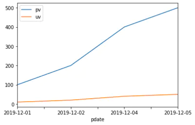
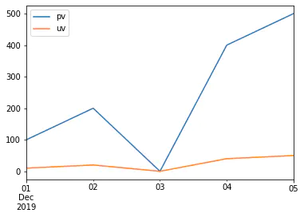

Pandas怎么处理日期索引的缺失？
==============================

问题：按日期统计的数据，缺失了某天，导致数据不全该怎么补充日期？

| 可以用两种方法实现：

    | 1、DataFrame.reindex，调整 dataframe 的索引以适应新的索引
    | 2、DataFrame.resample，可以对时间序列重采样，支持补充缺失值

问题：如果缺失了索引该怎么填充？
--------------------------------

.. code:: ipython3

    import pandas as pd
    %matplotlib inline

.. code:: ipython3

    df = pd.DataFrame({
        "pdate": ["2019-12-01", "2019-12-02", "2019-12-04", "2019-12-05"],
        "pv": [100, 200, 400, 500],
        "uv": [10, 20, 40, 50],
    })
    
    df

.. raw:: html

    

    
    <table border="1" class="dataframe">
      <thead>
        <tr style="text-align: right;">
          <th></th>
          <th>pdate</th>
          <th>pv</th>
          <th>uv</th>
        </tr>
      </thead>
      <tbody>
        <tr>
          <td>0</td>
          <td>2019-12-01</td>
          <td>100</td>
          <td>10</td>
        </tr>
        <tr>
          <td>1</td>
          <td>2019-12-02</td>
          <td>200</td>
          <td>20</td>
        </tr>
        <tr>
          <td>2</td>
          <td>2019-12-04</td>
          <td>400</td>
          <td>40</td>
        </tr>
        <tr>
          <td>3</td>
          <td>2019-12-05</td>
          <td>500</td>
          <td>50</td>
        </tr>
      </tbody>
    </table>
    

.. code:: ipython3

    df.set_index("pdate").plot()

.. parsed-literal::

    <matplotlib.axes._subplots.AxesSubplot at 0x1a0d908bf48>

**问题，这里缺失了2019-12-03的数据，导致数据不全该怎么补充？**

方法1：使用 pandas.reindex 方法
-----------------------------

将 df 的索引变成日期索引
~~~~~~~~~~~~~~~~~~~~~~~~~

.. code:: ipython3

    df_date = df.set_index("pdate")
    df_date

.. raw:: html

    

    
    <table border="1" class="dataframe">
      <thead>
        <tr style="text-align: right;">
          <th></th>
          <th>pv</th>
          <th>uv</th>
        </tr>
        <tr>
          <th>pdate</th>
          <th></th>
          <th></th>
        </tr>
      </thead>
      <tbody>
        <tr>
          <td>2019-12-01</td>
          <td>100</td>
          <td>10</td>
        </tr>
        <tr>
          <td>2019-12-02</td>
          <td>200</td>
          <td>20</td>
        </tr>
        <tr>
          <td>2019-12-04</td>
          <td>400</td>
          <td>40</td>
        </tr>
        <tr>
          <td>2019-12-05</td>
          <td>500</td>
          <td>50</td>
        </tr>
      </tbody>
    </table>
    

.. code:: ipython3

    df_date.index

.. parsed-literal::

    Index(['2019-12-01', '2019-12-02', '2019-12-04', '2019-12-05'], dtype='object', name='pdate')

.. code:: ipython3

    # 将df的索引设置为日期索引
    df_date = df_date.set_index(pd.to_datetime(df_date.index))
    df_date

.. raw:: html

    

    
    <table border="1" class="dataframe">
      <thead>
        <tr style="text-align: right;">
          <th></th>
          <th>pv</th>
          <th>uv</th>
        </tr>
        <tr>
          <th>pdate</th>
          <th></th>
          <th></th>
        </tr>
      </thead>
      <tbody>
        <tr>
          <td>2019-12-01</td>
          <td>100</td>
          <td>10</td>
        </tr>
        <tr>
          <td>2019-12-02</td>
          <td>200</td>
          <td>20</td>
        </tr>
        <tr>
          <td>2019-12-04</td>
          <td>400</td>
          <td>40</td>
        </tr>
        <tr>
          <td>2019-12-05</td>
          <td>500</td>
          <td>50</td>
        </tr>
      </tbody>
    </table>
    

.. code:: ipython3

    df_date.index

.. parsed-literal::

    DatetimeIndex(['2019-12-01', '2019-12-02', '2019-12-04', '2019-12-05'], dtype='datetime64[ns]', name='pdate', freq=None)

使用 pandas.reindex 填充缺失的索引
~~~~~~~~~~~~~~~~~~~~~~~~~~~~~~~~~~~

.. code:: ipython3

    # 生成完整的日期序列
    pdates = pd.date_range(start="2019-12-01", end="2019-12-05")
    pdates

.. parsed-literal::

    DatetimeIndex(['2019-12-01', '2019-12-02', '2019-12-03', '2019-12-04',
                   '2019-12-05'],
                  dtype='datetime64[ns]', freq='D')

.. code:: ipython3

    df_date_new = df_date.reindex(pdates, fill_value=0)
    df_date_new

.. raw:: html

    

    
    <table border="1" class="dataframe">
      <thead>
        <tr style="text-align: right;">
          <th></th>
          <th>pv</th>
          <th>uv</th>
        </tr>
      </thead>
      <tbody>
        <tr>
          <td>2019-12-01</td>
          <td>100</td>
          <td>10</td>
        </tr>
        <tr>
          <td>2019-12-02</td>
          <td>200</td>
          <td>20</td>
        </tr>
        <tr>
          <td>2019-12-03</td>
          <td>0</td>
          <td>0</td>
        </tr>
        <tr>
          <td>2019-12-04</td>
          <td>400</td>
          <td>40</td>
        </tr>
        <tr>
          <td>2019-12-05</td>
          <td>500</td>
          <td>50</td>
        </tr>
      </tbody>
    </table>
    

    
.. code:: ipython3

    df_date_new.plot()

.. parsed-literal::

    <matplotlib.axes._subplots.AxesSubplot at 0x1a0db1ab388>

方法2：使用 pandas.resample 方法
------------------------------

先将索引变成日期索引
~~~~~~~~~~~~~~~~~~~~~~~

.. code:: ipython3

    df

.. raw:: html

    

    
    <table border="1" class="dataframe">
      <thead>
        <tr style="text-align: right;">
          <th></th>
          <th>pdate</th>
          <th>pv</th>
          <th>uv</th>
        </tr>
      </thead>
      <tbody>
        <tr>
          <td>0</td>
          <td>2019-12-01</td>
          <td>100</td>
          <td>10</td>
        </tr>
        <tr>
          <td>1</td>
          <td>2019-12-02</td>
          <td>200</td>
          <td>20</td>
        </tr>
        <tr>
          <td>2</td>
          <td>2019-12-04</td>
          <td>400</td>
          <td>40</td>
        </tr>
        <tr>
          <td>3</td>
          <td>2019-12-05</td>
          <td>500</td>
          <td>50</td>
        </tr>
      </tbody>
    </table>
    

.. code:: ipython3

    df_new2 = df.set_index(pd.to_datetime(df["pdate"])).drop("pdate", axis=1)
    df_new2

.. raw:: html

    

    
    <table border="1" class="dataframe">
      <thead>
        <tr style="text-align: right;">
          <th></th>
          <th>pv</th>
          <th>uv</th>
        </tr>
        <tr>
          <th>pdate</th>
          <th></th>
          <th></th>
        </tr>
      </thead>
      <tbody>
        <tr>
          <td>2019-12-01</td>
          <td>100</td>
          <td>10</td>
        </tr>
        <tr>
          <td>2019-12-02</td>
          <td>200</td>
          <td>20</td>
        </tr>
        <tr>
          <td>2019-12-04</td>
          <td>400</td>
          <td>40</td>
        </tr>
        <tr>
          <td>2019-12-05</td>
          <td>500</td>
          <td>50</td>
        </tr>
      </tbody>
    </table>
    

.. code:: ipython3

    df_new2.index

.. parsed-literal::

    DatetimeIndex(['2019-12-01', '2019-12-02', '2019-12-04', '2019-12-05'], dtype='datetime64[ns]', name='pdate', freq=None)

使用 dataframe 的 resample 的方法按照天重采样
~~~~~~~~~~~~~~~~~~~~~~~~~~~~~~~~~~~~~~~~~~~~

    | resample 的含义：改变数据的时间频率，比如把天数据变成月份，或者把小时数据变成分钟级别
    | resample 的语法：(DataFrame or Series).resample(arguments).(aggregate function)

| resample的采样规则参数：https://pandas.pydata.org/pandas-docs/stable/user_guide/timeseries.html#offset-aliases

.. code:: ipython3

    # 由于采样会让区间变成一个值，所以需要指定mean等采样值的设定方法
    df_new2 = df_new2.resample("D").mean().fillna(0)
    df_new2

.. raw:: html

    

    
    <table border="1" class="dataframe">
      <thead>
        <tr style="text-align: right;">
          <th></th>
          <th>pv</th>
          <th>uv</th>
        </tr>
        <tr>
          <th>pdate</th>
          <th></th>
          <th></th>
        </tr>
      </thead>
      <tbody>
        <tr>
          <td>2019-12-01</td>
          <td>100.0</td>
          <td>10.0</td>
        </tr>
        <tr>
          <td>2019-12-02</td>
          <td>200.0</td>
          <td>20.0</td>
        </tr>
        <tr>
          <td>2019-12-03</td>
          <td>0.0</td>
          <td>0.0</td>
        </tr>
        <tr>
          <td>2019-12-04</td>
          <td>400.0</td>
          <td>40.0</td>
        </tr>
        <tr>
          <td>2019-12-05</td>
          <td>500.0</td>
          <td>50.0</td>
        </tr>
      </tbody>
    </table>
    

.. code:: ipython3

    # resample的使用方式
    df_new2.resample("2D").mean()

.. raw:: html

    

    
    <table border="1" class="dataframe">
      <thead>
        <tr style="text-align: right;">
          <th></th>
          <th>pv</th>
          <th>uv</th>
        </tr>
        <tr>
          <th>pdate</th>
          <th></th>
          <th></th>
        </tr>
      </thead>
      <tbody>
        <tr>
          <td>2019-12-01</td>
          <td>150.0</td>
          <td>15.0</td>
        </tr>
        <tr>
          <td>2019-12-03</td>
          <td>200.0</td>
          <td>20.0</td>
        </tr>
        <tr>
          <td>2019-12-05</td>
          <td>500.0</td>
          <td>50.0</td>
        </tr>
      </tbody>
    </table>
    

