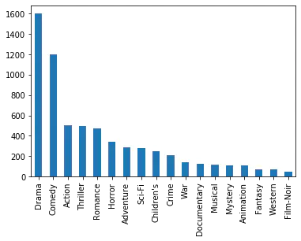

Pandas使用explode实现一行变多行统计
-----------------------------------

解决实际问题：一个字段包含多个值，怎样将这个值拆分成多行，然后实现统计

比如：一个电影有多个分类、一个人有多个喜好，需要按分类、喜好做统计

读取数据
~~~~~~~~~~~

.. code:: ipython3

    import pandas as pd

.. code:: ipython3

    df = pd.read_csv(
        "./datas/movielens-1m/movies.dat",
        header=None,
        names="MovieID::Title::Genres".split("::"),
        sep="::",
        engine="python"
    )

.. code:: ipython3

    df.head()

.. raw:: html

    

    
    <table border="1" class="dataframe">
      <thead>
        <tr style="text-align: right;">
          <th></th>
          <th>MovieID</th>
          <th>Title</th>
          <th>Genres</th>
        </tr>
      </thead>
      <tbody>
        <tr>
          <td>0</td>
          <td>1</td>
          <td>Toy Story (1995)</td>
          <td>Animation|Children's|Comedy</td>
        </tr>
        <tr>
          <td>1</td>
          <td>2</td>
          <td>Jumanji (1995)</td>
          <td>Adventure|Children's|Fantasy</td>
        </tr>
        <tr>
          <td>2</td>
          <td>3</td>
          <td>Grumpier Old Men (1995)</td>
          <td>Comedy|Romance</td>
        </tr>
        <tr>
          <td>3</td>
          <td>4</td>
          <td>Waiting to Exhale (1995)</td>
          <td>Comedy|Drama</td>
        </tr>
        <tr>
          <td>4</td>
          <td>5</td>
          <td>Father of the Bride Part II (1995)</td>
          <td>Comedy</td>
        </tr>
      </tbody>
    </table>
    

**问题：怎样实现这样的统计，每个题材有多少部电影？**

解决思路： 

    | 将 Genres 按照分隔符 拆分 
    | 按 Genres 拆分成多行 
    | 统计每个 Genres 下的电影数目

将 Genres 字段拆分成列表
~~~~~~~~~~~~~~~~~~~~~~~~~

.. code:: ipython3

    df.info()

.. parsed-literal::

    <class 'pandas.core.frame.DataFrame'>
    RangeIndex: 3883 entries, 0 to 3882
    Data columns (total 3 columns):
    MovieID    3883 non-null int64
    Title      3883 non-null object
    Genres     3883 non-null object
    dtypes: int64(1), object(2)
    memory usage: 91.1+ KB

.. code:: ipython3

    # 当前的Genres字段是字符串类型
    type(df.iloc[0]["Genres"])

.. parsed-literal::

    str

.. code:: ipython3

    # 新增一列
    df["Genre"] = df["Genres"].map(lambda x:x.split("|"))

.. code:: ipython3

    df.head()

.. raw:: html

    

    
    <table border="1" class="dataframe">
      <thead>
        <tr style="text-align: right;">
          <th></th>
          <th>MovieID</th>
          <th>Title</th>
          <th>Genres</th>
          <th>Genre</th>
        </tr>
      </thead>
      <tbody>
        <tr>
          <td>0</td>
          <td>1</td>
          <td>Toy Story (1995)</td>
          <td>Animation|Children's|Comedy</td>
          <td>[Animation, Children's, Comedy]</td>
        </tr>
        <tr>
          <td>1</td>
          <td>2</td>
          <td>Jumanji (1995)</td>
          <td>Adventure|Children's|Fantasy</td>
          <td>[Adventure, Children's, Fantasy]</td>
        </tr>
        <tr>
          <td>2</td>
          <td>3</td>
          <td>Grumpier Old Men (1995)</td>
          <td>Comedy|Romance</td>
          <td>[Comedy, Romance]</td>
        </tr>
        <tr>
          <td>3</td>
          <td>4</td>
          <td>Waiting to Exhale (1995)</td>
          <td>Comedy|Drama</td>
          <td>[Comedy, Drama]</td>
        </tr>
        <tr>
          <td>4</td>
          <td>5</td>
          <td>Father of the Bride Part II (1995)</td>
          <td>Comedy</td>
          <td>[Comedy]</td>
        </tr>
      </tbody>
    </table>
    

.. code:: ipython3

    # Genre的类型是列表
    print(df["Genre"][0])
    print(type(df["Genre"][0]))

.. parsed-literal::

    ['Animation', "Children's", 'Comedy']
    <class 'list'>

.. code:: ipython3

    df.info()

.. parsed-literal::

    <class 'pandas.core.frame.DataFrame'>
    RangeIndex: 3883 entries, 0 to 3882
    Data columns (total 4 columns):
    MovieID    3883 non-null int64
    Title      3883 non-null object
    Genres     3883 non-null object
    Genre      3883 non-null object
    dtypes: int64(1), object(3)
    memory usage: 121.5+ KB

使用 explode 将一行拆分成多行
~~~~~~~~~~~~~~~~~~~~~~~~~~~~~~

    | 语法：pandas.DataFrame.explode(column)
    | 将 dataframe 的一个 list-like 的元素按行复制，index 索引随之复制

.. code:: ipython3

    df_new = df.explode("Genre")

.. code:: ipython3

    df_new.head(10)

.. raw:: html

    

    
    <table border="1" class="dataframe">
      <thead>
        <tr style="text-align: right;">
          <th></th>
          <th>MovieID</th>
          <th>Title</th>
          <th>Genres</th>
          <th>Genre</th>
        </tr>
      </thead>
      <tbody>
        <tr>
          <td>0</td>
          <td>1</td>
          <td>Toy Story (1995)</td>
          <td>Animation|Children's|Comedy</td>
          <td>Animation</td>
        </tr>
        <tr>
          <td>0</td>
          <td>1</td>
          <td>Toy Story (1995)</td>
          <td>Animation|Children's|Comedy</td>
          <td>Children's</td>
        </tr>
        <tr>
          <td>0</td>
          <td>1</td>
          <td>Toy Story (1995)</td>
          <td>Animation|Children's|Comedy</td>
          <td>Comedy</td>
        </tr>
        <tr>
          <td>1</td>
          <td>2</td>
          <td>Jumanji (1995)</td>
          <td>Adventure|Children's|Fantasy</td>
          <td>Adventure</td>
        </tr>
        <tr>
          <td>1</td>
          <td>2</td>
          <td>Jumanji (1995)</td>
          <td>Adventure|Children's|Fantasy</td>
          <td>Children's</td>
        </tr>
        <tr>
          <td>1</td>
          <td>2</td>
          <td>Jumanji (1995)</td>
          <td>Adventure|Children's|Fantasy</td>
          <td>Fantasy</td>
        </tr>
        <tr>
          <td>2</td>
          <td>3</td>
          <td>Grumpier Old Men (1995)</td>
          <td>Comedy|Romance</td>
          <td>Comedy</td>
        </tr>
        <tr>
          <td>2</td>
          <td>3</td>
          <td>Grumpier Old Men (1995)</td>
          <td>Comedy|Romance</td>
          <td>Romance</td>
        </tr>
        <tr>
          <td>3</td>
          <td>4</td>
          <td>Waiting to Exhale (1995)</td>
          <td>Comedy|Drama</td>
          <td>Comedy</td>
        </tr>
        <tr>
          <td>3</td>
          <td>4</td>
          <td>Waiting to Exhale (1995)</td>
          <td>Comedy|Drama</td>
          <td>Drama</td>
        </tr>
      </tbody>
    </table>
    

实现拆分后的题材的统计
~~~~~~~~~~~~~~~~~~~~~~~~~

.. code:: ipython3

    %matplotlib inline
    df_new["Genre"].value_counts().plot.bar()

.. parsed-literal::

    <matplotlib.axes._subplots.AxesSubplot at 0x23d73917cc8>

