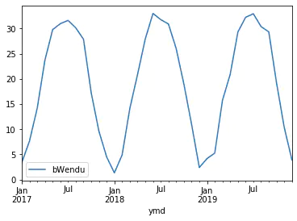

Pandas计算同比环比指标的3种方法
-------------------------------

同比和环比：环比和同比用于描述统计数据的变化情况
^^^^^^^^^^^^^^^^^^^^^^^^^^^^^^^^^^^^^^^^^^^^^^^^

-  环比：表示本次统计段与相连的上次统计段之间的比较。

   -  比如2010年中国第一季度GDP为G2010Q1亿元，第二季度GDP为G2010Q2亿元，则第二季度GDP环比增长（G2010Q2-G2010Q1)/G2010Q1；

-  同比：即同期相比，表示某个特定统计段今年与去年之间的比较。

   -  比如2009年中国第一季度GDP为G2009Q1亿元，则2010年第一季度的GDP同比增长为（G2010Q1-G2009Q1)/G2009Q1。

演示步骤： 0. 读取连续3年的天气数据 1. 方法1：pandas.Series.pct_change
2. 方法2：pandas.Series.shift 3. 方法3：pandas.Series.diff

pct_change、shift、diff，都实现了跨越多行的数据计算

0. 读取连续3年的天气数据
~~~~~~~~~~~~~~~~~~~~~~~~

.. code:: ipython3

    import pandas as pd
    %matplotlib inline

.. code:: ipython3

    fpath = "./datas/beijing_tianqi/beijing_tianqi_2017-2019.csv"
    df = pd.read_csv(fpath, index_col="ymd", parse_dates=True)

.. code:: ipython3

    df.head(3)

.. raw:: html

    

    
    <table border="1" class="dataframe">
      <thead>
        <tr style="text-align: right;">
          <th></th>
          <th>bWendu</th>
          <th>yWendu</th>
          <th>tianqi</th>
          <th>fengxiang</th>
          <th>fengli</th>
          <th>aqi</th>
          <th>aqiInfo</th>
          <th>aqiLevel</th>
        </tr>
        <tr>
          <th>ymd</th>
          <th></th>
          <th></th>
          <th></th>
          <th></th>
          <th></th>
          <th></th>
          <th></th>
          <th></th>
        </tr>
      </thead>
      <tbody>
        <tr>
          <td>2017-01-01</td>
          <td>5℃</td>
          <td>-3℃</td>
          <td>霾~晴</td>
          <td>南风</td>
          <td>1-2级</td>
          <td>450</td>
          <td>严重污染</td>
          <td>6</td>
        </tr>
        <tr>
          <td>2017-01-02</td>
          <td>7℃</td>
          <td>-6℃</td>
          <td>晴~霾</td>
          <td>南风</td>
          <td>1-2级</td>
          <td>246</td>
          <td>重度污染</td>
          <td>5</td>
        </tr>
        <tr>
          <td>2017-01-03</td>
          <td>5℃</td>
          <td>-5℃</td>
          <td>霾</td>
          <td>南风</td>
          <td>1-2级</td>
          <td>320</td>
          <td>严重污染</td>
          <td>6</td>
        </tr>
      </tbody>
    </table>
    

.. code:: ipython3

    # 替换掉温度的后缀℃
    df["bWendu"] = df["bWendu"].str.replace("℃", "").astype('int32')

.. code:: ipython3

    df.head(3)

.. raw:: html

    

    
    <table border="1" class="dataframe">
      <thead>
        <tr style="text-align: right;">
          <th></th>
          <th>bWendu</th>
          <th>yWendu</th>
          <th>tianqi</th>
          <th>fengxiang</th>
          <th>fengli</th>
          <th>aqi</th>
          <th>aqiInfo</th>
          <th>aqiLevel</th>
        </tr>
        <tr>
          <th>ymd</th>
          <th></th>
          <th></th>
          <th></th>
          <th></th>
          <th></th>
          <th></th>
          <th></th>
          <th></th>
        </tr>
      </thead>
      <tbody>
        <tr>
          <td>2017-01-01</td>
          <td>5</td>
          <td>-3℃</td>
          <td>霾~晴</td>
          <td>南风</td>
          <td>1-2级</td>
          <td>450</td>
          <td>严重污染</td>
          <td>6</td>
        </tr>
        <tr>
          <td>2017-01-02</td>
          <td>7</td>
          <td>-6℃</td>
          <td>晴~霾</td>
          <td>南风</td>
          <td>1-2级</td>
          <td>246</td>
          <td>重度污染</td>
          <td>5</td>
        </tr>
        <tr>
          <td>2017-01-03</td>
          <td>5</td>
          <td>-5℃</td>
          <td>霾</td>
          <td>南风</td>
          <td>1-2级</td>
          <td>320</td>
          <td>严重污染</td>
          <td>6</td>
        </tr>
      </tbody>
    </table>
    

.. code:: ipython3

    # 新的df，为每个月的平均最高温
    df = df[["bWendu"]].resample("M").mean()

.. code:: ipython3

    # 将索引按照日期升序排列
    df.sort_index(ascending=True, inplace=True)

.. code:: ipython3

    df.head()

.. raw:: html

    

    
    <table border="1" class="dataframe">
      <thead>
        <tr style="text-align: right;">
          <th></th>
          <th>bWendu</th>
        </tr>
        <tr>
          <th>ymd</th>
          <th></th>
        </tr>
      </thead>
      <tbody>
        <tr>
          <td>2017-01-31</td>
          <td>3.322581</td>
        </tr>
        <tr>
          <td>2017-02-28</td>
          <td>7.642857</td>
        </tr>
        <tr>
          <td>2017-03-31</td>
          <td>14.129032</td>
        </tr>
        <tr>
          <td>2017-04-30</td>
          <td>23.700000</td>
        </tr>
        <tr>
          <td>2017-05-31</td>
          <td>29.774194</td>
        </tr>
      </tbody>
    </table>
    

.. code:: ipython3

    df.index

.. parsed-literal::

    DatetimeIndex(['2017-01-31', '2017-02-28', '2017-03-31', '2017-04-30',
                   '2017-05-31', '2017-06-30', '2017-07-31', '2017-08-31',
                   '2017-09-30', '2017-10-31', '2017-11-30', '2017-12-31',
                   '2018-01-31', '2018-02-28', '2018-03-31', '2018-04-30',
                   '2018-05-31', '2018-06-30', '2018-07-31', '2018-08-31',
                   '2018-09-30', '2018-10-31', '2018-11-30', '2018-12-31',
                   '2019-01-31', '2019-02-28', '2019-03-31', '2019-04-30',
                   '2019-05-31', '2019-06-30', '2019-07-31', '2019-08-31',
                   '2019-09-30', '2019-10-31', '2019-11-30', '2019-12-31'],
                  dtype='datetime64[ns]', name='ymd', freq='M')

.. code:: ipython3

    df.plot()

.. parsed-literal::

    <matplotlib.axes._subplots.AxesSubplot at 0x13d8d77dc48>

方法1：pandas.Series.pct_change
~~~~~~~~~~~~~~~~~~~~~~~~~~~~~~~

pct_change方法直接算好了“(新-旧)/旧”的百分比

官方文档地址：https://pandas.pydata.org/pandas-docs/stable/reference/api/pandas.Series.pct_change.html

.. code:: ipython3

    df["bWendu_way1_huanbi"] = df["bWendu"].pct_change(periods=1)
    df["bWendu_way1_tongbi"] = df["bWendu"].pct_change(periods=12)

.. code:: ipython3

    df.head(15)

.. raw:: html

    

    
    <table border="1" class="dataframe">
      <thead>
        <tr style="text-align: right;">
          <th></th>
          <th>bWendu</th>
          <th>bWendu_way1_huanbi</th>
          <th>bWendu_way1_tongbi</th>
        </tr>
        <tr>
          <th>ymd</th>
          <th></th>
          <th></th>
          <th></th>
        </tr>
      </thead>
      <tbody>
        <tr>
          <td>2017-01-31</td>
          <td>3.322581</td>
          <td>NaN</td>
          <td>NaN</td>
        </tr>
        <tr>
          <td>2017-02-28</td>
          <td>7.642857</td>
          <td>1.300277</td>
          <td>NaN</td>
        </tr>
        <tr>
          <td>2017-03-31</td>
          <td>14.129032</td>
          <td>0.848658</td>
          <td>NaN</td>
        </tr>
        <tr>
          <td>2017-04-30</td>
          <td>23.700000</td>
          <td>0.677397</td>
          <td>NaN</td>
        </tr>
        <tr>
          <td>2017-05-31</td>
          <td>29.774194</td>
          <td>0.256295</td>
          <td>NaN</td>
        </tr>
        <tr>
          <td>2017-06-30</td>
          <td>30.966667</td>
          <td>0.040051</td>
          <td>NaN</td>
        </tr>
        <tr>
          <td>2017-07-31</td>
          <td>31.612903</td>
          <td>0.020869</td>
          <td>NaN</td>
        </tr>
        <tr>
          <td>2017-08-31</td>
          <td>30.129032</td>
          <td>-0.046939</td>
          <td>NaN</td>
        </tr>
        <tr>
          <td>2017-09-30</td>
          <td>27.866667</td>
          <td>-0.075089</td>
          <td>NaN</td>
        </tr>
        <tr>
          <td>2017-10-31</td>
          <td>17.225806</td>
          <td>-0.381849</td>
          <td>NaN</td>
        </tr>
        <tr>
          <td>2017-11-30</td>
          <td>9.566667</td>
          <td>-0.444632</td>
          <td>NaN</td>
        </tr>
        <tr>
          <td>2017-12-31</td>
          <td>4.483871</td>
          <td>-0.531303</td>
          <td>NaN</td>
        </tr>
        <tr>
          <td>2018-01-31</td>
          <td>1.322581</td>
          <td>-0.705036</td>
          <td>-0.601942</td>
        </tr>
        <tr>
          <td>2018-02-28</td>
          <td>4.892857</td>
          <td>2.699477</td>
          <td>-0.359813</td>
        </tr>
        <tr>
          <td>2018-03-31</td>
          <td>14.129032</td>
          <td>1.887685</td>
          <td>0.000000</td>
        </tr>
      </tbody>
    </table>
    

方法2：pandas.Series.shift
~~~~~~~~~~~~~~~~~~~~~~~~~~

shift用于移动数据，但是保持索引不变

官方文档地址：https://pandas.pydata.org/pandas-docs/stable/reference/api/pandas.Series.shift.html

.. code:: ipython3

    # 见识一下shift做了什么事情
    # 使用pd.concat合并Series列表变成一个大的df
    pd.concat(
        [df["bWendu"], 
         df["bWendu"].shift(periods=1), 
         df["bWendu"].shift(periods=12)],
        axis=1
    ).head(15)

.. raw:: html

    

    
    <table border="1" class="dataframe">
      <thead>
        <tr style="text-align: right;">
          <th></th>
          <th>bWendu</th>
          <th>bWendu</th>
          <th>bWendu</th>
        </tr>
        <tr>
          <th>ymd</th>
          <th></th>
          <th></th>
          <th></th>
        </tr>
      </thead>
      <tbody>
        <tr>
          <td>2017-01-31</td>
          <td>3.322581</td>
          <td>NaN</td>
          <td>NaN</td>
        </tr>
        <tr>
          <td>2017-02-28</td>
          <td>7.642857</td>
          <td>3.322581</td>
          <td>NaN</td>
        </tr>
        <tr>
          <td>2017-03-31</td>
          <td>14.129032</td>
          <td>7.642857</td>
          <td>NaN</td>
        </tr>
        <tr>
          <td>2017-04-30</td>
          <td>23.700000</td>
          <td>14.129032</td>
          <td>NaN</td>
        </tr>
        <tr>
          <td>2017-05-31</td>
          <td>29.774194</td>
          <td>23.700000</td>
          <td>NaN</td>
        </tr>
        <tr>
          <td>2017-06-30</td>
          <td>30.966667</td>
          <td>29.774194</td>
          <td>NaN</td>
        </tr>
        <tr>
          <td>2017-07-31</td>
          <td>31.612903</td>
          <td>30.966667</td>
          <td>NaN</td>
        </tr>
        <tr>
          <td>2017-08-31</td>
          <td>30.129032</td>
          <td>31.612903</td>
          <td>NaN</td>
        </tr>
        <tr>
          <td>2017-09-30</td>
          <td>27.866667</td>
          <td>30.129032</td>
          <td>NaN</td>
        </tr>
        <tr>
          <td>2017-10-31</td>
          <td>17.225806</td>
          <td>27.866667</td>
          <td>NaN</td>
        </tr>
        <tr>
          <td>2017-11-30</td>
          <td>9.566667</td>
          <td>17.225806</td>
          <td>NaN</td>
        </tr>
        <tr>
          <td>2017-12-31</td>
          <td>4.483871</td>
          <td>9.566667</td>
          <td>NaN</td>
        </tr>
        <tr>
          <td>2018-01-31</td>
          <td>1.322581</td>
          <td>4.483871</td>
          <td>3.322581</td>
        </tr>
        <tr>
          <td>2018-02-28</td>
          <td>4.892857</td>
          <td>1.322581</td>
          <td>7.642857</td>
        </tr>
        <tr>
          <td>2018-03-31</td>
          <td>14.129032</td>
          <td>4.892857</td>
          <td>14.129032</td>
        </tr>
      </tbody>
    </table>
    

.. code:: ipython3

    # 环比
    series_shift1 = df["bWendu"].shift(periods=1)
    df["bWendu_way2_huanbi"] = (df["bWendu"]-series_shift1)/series_shift1
    
    # 同比
    series_shift2 = df["bWendu"].shift(periods=12)
    df["bWendu_way2_tongbi"] = (df["bWendu"]-series_shift2)/series_shift2

.. code:: ipython3

    df.head(15)

.. raw:: html

    

    
    <table border="1" class="dataframe">
      <thead>
        <tr style="text-align: right;">
          <th></th>
          <th>bWendu</th>
          <th>bWendu_way1_huanbi</th>
          <th>bWendu_way1_tongbi</th>
          <th>bWendu_way2_huanbi</th>
          <th>bWendu_way2_tongbi</th>
        </tr>
        <tr>
          <th>ymd</th>
          <th></th>
          <th></th>
          <th></th>
          <th></th>
          <th></th>
        </tr>
      </thead>
      <tbody>
        <tr>
          <td>2017-01-31</td>
          <td>3.322581</td>
          <td>NaN</td>
          <td>NaN</td>
          <td>NaN</td>
          <td>NaN</td>
        </tr>
        <tr>
          <td>2017-02-28</td>
          <td>7.642857</td>
          <td>1.300277</td>
          <td>NaN</td>
          <td>1.300277</td>
          <td>NaN</td>
        </tr>
        <tr>
          <td>2017-03-31</td>
          <td>14.129032</td>
          <td>0.848658</td>
          <td>NaN</td>
          <td>0.848658</td>
          <td>NaN</td>
        </tr>
        <tr>
          <td>2017-04-30</td>
          <td>23.700000</td>
          <td>0.677397</td>
          <td>NaN</td>
          <td>0.677397</td>
          <td>NaN</td>
        </tr>
        <tr>
          <td>2017-05-31</td>
          <td>29.774194</td>
          <td>0.256295</td>
          <td>NaN</td>
          <td>0.256295</td>
          <td>NaN</td>
        </tr>
        <tr>
          <td>2017-06-30</td>
          <td>30.966667</td>
          <td>0.040051</td>
          <td>NaN</td>
          <td>0.040051</td>
          <td>NaN</td>
        </tr>
        <tr>
          <td>2017-07-31</td>
          <td>31.612903</td>
          <td>0.020869</td>
          <td>NaN</td>
          <td>0.020869</td>
          <td>NaN</td>
        </tr>
        <tr>
          <td>2017-08-31</td>
          <td>30.129032</td>
          <td>-0.046939</td>
          <td>NaN</td>
          <td>-0.046939</td>
          <td>NaN</td>
        </tr>
        <tr>
          <td>2017-09-30</td>
          <td>27.866667</td>
          <td>-0.075089</td>
          <td>NaN</td>
          <td>-0.075089</td>
          <td>NaN</td>
        </tr>
        <tr>
          <td>2017-10-31</td>
          <td>17.225806</td>
          <td>-0.381849</td>
          <td>NaN</td>
          <td>-0.381849</td>
          <td>NaN</td>
        </tr>
        <tr>
          <td>2017-11-30</td>
          <td>9.566667</td>
          <td>-0.444632</td>
          <td>NaN</td>
          <td>-0.444632</td>
          <td>NaN</td>
        </tr>
        <tr>
          <td>2017-12-31</td>
          <td>4.483871</td>
          <td>-0.531303</td>
          <td>NaN</td>
          <td>-0.531303</td>
          <td>NaN</td>
        </tr>
        <tr>
          <td>2018-01-31</td>
          <td>1.322581</td>
          <td>-0.705036</td>
          <td>-0.601942</td>
          <td>-0.705036</td>
          <td>-0.601942</td>
        </tr>
        <tr>
          <td>2018-02-28</td>
          <td>4.892857</td>
          <td>2.699477</td>
          <td>-0.359813</td>
          <td>2.699477</td>
          <td>-0.359813</td>
        </tr>
        <tr>
          <td>2018-03-31</td>
          <td>14.129032</td>
          <td>1.887685</td>
          <td>0.000000</td>
          <td>1.887685</td>
          <td>0.000000</td>
        </tr>
      </tbody>
    </table>
    

方法3. pandas.Series.diff
~~~~~~~~~~~~~~~~~~~~~~~~~

pandas.Series.diff用于新值减去旧值

官方文档：https://pandas.pydata.org/pandas-docs/stable/reference/api/pandas.Series.diff.html

.. code:: ipython3

    pd.concat(
        [df["bWendu"], 
         df["bWendu"].diff(periods=1), 
         df["bWendu"].diff(periods=12)],
        axis=1
    ).head(15)

.. raw:: html

    

    
    <table border="1" class="dataframe">
      <thead>
        <tr style="text-align: right;">
          <th></th>
          <th>bWendu</th>
          <th>bWendu</th>
          <th>bWendu</th>
        </tr>
        <tr>
          <th>ymd</th>
          <th></th>
          <th></th>
          <th></th>
        </tr>
      </thead>
      <tbody>
        <tr>
          <td>2017-01-31</td>
          <td>3.322581</td>
          <td>NaN</td>
          <td>NaN</td>
        </tr>
        <tr>
          <td>2017-02-28</td>
          <td>7.642857</td>
          <td>4.320276</td>
          <td>NaN</td>
        </tr>
        <tr>
          <td>2017-03-31</td>
          <td>14.129032</td>
          <td>6.486175</td>
          <td>NaN</td>
        </tr>
        <tr>
          <td>2017-04-30</td>
          <td>23.700000</td>
          <td>9.570968</td>
          <td>NaN</td>
        </tr>
        <tr>
          <td>2017-05-31</td>
          <td>29.774194</td>
          <td>6.074194</td>
          <td>NaN</td>
        </tr>
        <tr>
          <td>2017-06-30</td>
          <td>30.966667</td>
          <td>1.192473</td>
          <td>NaN</td>
        </tr>
        <tr>
          <td>2017-07-31</td>
          <td>31.612903</td>
          <td>0.646237</td>
          <td>NaN</td>
        </tr>
        <tr>
          <td>2017-08-31</td>
          <td>30.129032</td>
          <td>-1.483871</td>
          <td>NaN</td>
        </tr>
        <tr>
          <td>2017-09-30</td>
          <td>27.866667</td>
          <td>-2.262366</td>
          <td>NaN</td>
        </tr>
        <tr>
          <td>2017-10-31</td>
          <td>17.225806</td>
          <td>-10.640860</td>
          <td>NaN</td>
        </tr>
        <tr>
          <td>2017-11-30</td>
          <td>9.566667</td>
          <td>-7.659140</td>
          <td>NaN</td>
        </tr>
        <tr>
          <td>2017-12-31</td>
          <td>4.483871</td>
          <td>-5.082796</td>
          <td>NaN</td>
        </tr>
        <tr>
          <td>2018-01-31</td>
          <td>1.322581</td>
          <td>-3.161290</td>
          <td>-2.00</td>
        </tr>
        <tr>
          <td>2018-02-28</td>
          <td>4.892857</td>
          <td>3.570276</td>
          <td>-2.75</td>
        </tr>
        <tr>
          <td>2018-03-31</td>
          <td>14.129032</td>
          <td>9.236175</td>
          <td>0.00</td>
        </tr>
      </tbody>
    </table>
    

.. code:: ipython3

    # 环比
    series_diff1 = df["bWendu"].diff(periods=1)
    df["bWendu_way3_huanbi"] = series_diff1/(df["bWendu"]-series_diff1)
    
    # 同比
    series_diff2 = df["bWendu"].diff(periods=12)
    df["bWendu_way3_tongbi"] = series_diff2/(df["bWendu"]-series_diff2)

.. code:: ipython3

    df.head(15)

.. raw:: html

    

    
    <table border="1" class="dataframe">
      <thead>
        <tr style="text-align: right;">
          <th></th>
          <th>bWendu</th>
          <th>bWendu_way1_huanbi</th>
          <th>bWendu_way1_tongbi</th>
          <th>bWendu_way2_huanbi</th>
          <th>bWendu_way2_tongbi</th>
          <th>bWendu_way3_huanbi</th>
          <th>bWendu_way3_tongbi</th>
        </tr>
        <tr>
          <th>ymd</th>
          <th></th>
          <th></th>
          <th></th>
          <th></th>
          <th></th>
          <th></th>
          <th></th>
        </tr>
      </thead>
      <tbody>
        <tr>
          <td>2017-01-31</td>
          <td>3.322581</td>
          <td>NaN</td>
          <td>NaN</td>
          <td>NaN</td>
          <td>NaN</td>
          <td>NaN</td>
          <td>NaN</td>
        </tr>
        <tr>
          <td>2017-02-28</td>
          <td>7.642857</td>
          <td>1.300277</td>
          <td>NaN</td>
          <td>1.300277</td>
          <td>NaN</td>
          <td>1.300277</td>
          <td>NaN</td>
        </tr>
        <tr>
          <td>2017-03-31</td>
          <td>14.129032</td>
          <td>0.848658</td>
          <td>NaN</td>
          <td>0.848658</td>
          <td>NaN</td>
          <td>0.848658</td>
          <td>NaN</td>
        </tr>
        <tr>
          <td>2017-04-30</td>
          <td>23.700000</td>
          <td>0.677397</td>
          <td>NaN</td>
          <td>0.677397</td>
          <td>NaN</td>
          <td>0.677397</td>
          <td>NaN</td>
        </tr>
        <tr>
          <td>2017-05-31</td>
          <td>29.774194</td>
          <td>0.256295</td>
          <td>NaN</td>
          <td>0.256295</td>
          <td>NaN</td>
          <td>0.256295</td>
          <td>NaN</td>
        </tr>
        <tr>
          <td>2017-06-30</td>
          <td>30.966667</td>
          <td>0.040051</td>
          <td>NaN</td>
          <td>0.040051</td>
          <td>NaN</td>
          <td>0.040051</td>
          <td>NaN</td>
        </tr>
        <tr>
          <td>2017-07-31</td>
          <td>31.612903</td>
          <td>0.020869</td>
          <td>NaN</td>
          <td>0.020869</td>
          <td>NaN</td>
          <td>0.020869</td>
          <td>NaN</td>
        </tr>
        <tr>
          <td>2017-08-31</td>
          <td>30.129032</td>
          <td>-0.046939</td>
          <td>NaN</td>
          <td>-0.046939</td>
          <td>NaN</td>
          <td>-0.046939</td>
          <td>NaN</td>
        </tr>
        <tr>
          <td>2017-09-30</td>
          <td>27.866667</td>
          <td>-0.075089</td>
          <td>NaN</td>
          <td>-0.075089</td>
          <td>NaN</td>
          <td>-0.075089</td>
          <td>NaN</td>
        </tr>
        <tr>
          <td>2017-10-31</td>
          <td>17.225806</td>
          <td>-0.381849</td>
          <td>NaN</td>
          <td>-0.381849</td>
          <td>NaN</td>
          <td>-0.381849</td>
          <td>NaN</td>
        </tr>
        <tr>
          <td>2017-11-30</td>
          <td>9.566667</td>
          <td>-0.444632</td>
          <td>NaN</td>
          <td>-0.444632</td>
          <td>NaN</td>
          <td>-0.444632</td>
          <td>NaN</td>
        </tr>
        <tr>
          <td>2017-12-31</td>
          <td>4.483871</td>
          <td>-0.531303</td>
          <td>NaN</td>
          <td>-0.531303</td>
          <td>NaN</td>
          <td>-0.531303</td>
          <td>NaN</td>
        </tr>
        <tr>
          <td>2018-01-31</td>
          <td>1.322581</td>
          <td>-0.705036</td>
          <td>-0.601942</td>
          <td>-0.705036</td>
          <td>-0.601942</td>
          <td>-0.705036</td>
          <td>-0.601942</td>
        </tr>
        <tr>
          <td>2018-02-28</td>
          <td>4.892857</td>
          <td>2.699477</td>
          <td>-0.359813</td>
          <td>2.699477</td>
          <td>-0.359813</td>
          <td>2.699477</td>
          <td>-0.359813</td>
        </tr>
        <tr>
          <td>2018-03-31</td>
          <td>14.129032</td>
          <td>1.887685</td>
          <td>0.000000</td>
          <td>1.887685</td>
          <td>0.000000</td>
          <td>1.887685</td>
          <td>0.000000</td>
        </tr>
      </tbody>
    </table>
    

