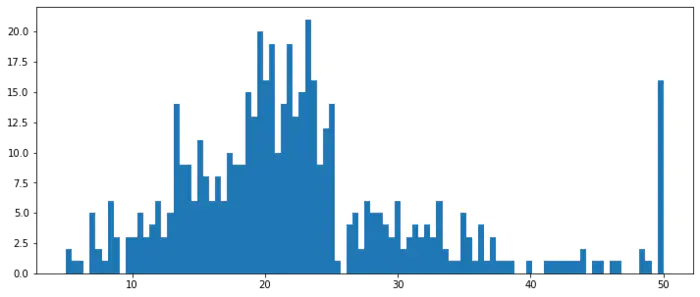

Pandas读取Excel绘制直方图
-------------------------

| **直方图(Histogram)：**
| 直方图是数值数据分布的精确图形表示，是一个连续变量（定量变量）的概率分布的估计，它是一种条形图。
| 为了构建直方图，第一步是将值的范围分段，即将整个值的范围分成一系列间隔，然后计算每个间隔中有多少值。

1. 读取数据
~~~~~~~~~~~

波斯顿房价数据集

.. code:: ipython3

    import pandas as pd
    import numpy as np

.. code:: ipython3

    df = pd.read_excel("./datas/boston-house-prices/housing.xlsx")

.. code:: ipython3

    df

.. raw:: html

    

    
    <table border="1" class="dataframe">
      <thead>
        <tr style="text-align: right;">
          <th></th>
          <th>CRIM</th>
          <th>ZN</th>
          <th>INDUS</th>
          <th>CHAS</th>
          <th>NOX</th>
          <th>RM</th>
          <th>AGE</th>
          <th>DIS</th>
          <th>RAD</th>
          <th>TAX</th>
          <th>PTRATIO</th>
          <th>B</th>
          <th>LSTAT</th>
          <th>MEDV</th>
        </tr>
      </thead>
      <tbody>
        <tr>
          <th>0</th>
          <td>0.00632</td>
          <td>18.0</td>
          <td>2.31</td>
          <td>0</td>
          <td>0.538</td>
          <td>6.575</td>
          <td>65.2</td>
          <td>4.0900</td>
          <td>1</td>
          <td>296</td>
          <td>15.3</td>
          <td>396.90</td>
          <td>4.98</td>
          <td>24.0</td>
        </tr>
        <tr>
          <th>1</th>
          <td>0.02731</td>
          <td>0.0</td>
          <td>7.07</td>
          <td>0</td>
          <td>0.469</td>
          <td>6.421</td>
          <td>78.9</td>
          <td>4.9671</td>
          <td>2</td>
          <td>242</td>
          <td>17.8</td>
          <td>396.90</td>
          <td>9.14</td>
          <td>21.6</td>
        </tr>
        <tr>
          <th>2</th>
          <td>0.02729</td>
          <td>0.0</td>
          <td>7.07</td>
          <td>0</td>
          <td>0.469</td>
          <td>7.185</td>
          <td>61.1</td>
          <td>4.9671</td>
          <td>2</td>
          <td>242</td>
          <td>17.8</td>
          <td>392.83</td>
          <td>4.03</td>
          <td>34.7</td>
        </tr>
        <tr>
          <th>3</th>
          <td>0.03237</td>
          <td>0.0</td>
          <td>2.18</td>
          <td>0</td>
          <td>0.458</td>
          <td>6.998</td>
          <td>45.8</td>
          <td>6.0622</td>
          <td>3</td>
          <td>222</td>
          <td>18.7</td>
          <td>394.63</td>
          <td>2.94</td>
          <td>33.4</td>
        </tr>
        <tr>
          <th>4</th>
          <td>0.06905</td>
          <td>0.0</td>
          <td>2.18</td>
          <td>0</td>
          <td>0.458</td>
          <td>7.147</td>
          <td>54.2</td>
          <td>6.0622</td>
          <td>3</td>
          <td>222</td>
          <td>18.7</td>
          <td>396.90</td>
          <td>5.33</td>
          <td>36.2</td>
        </tr>
        <tr>
          <th>...</th>
          <td>...</td>
          <td>...</td>
          <td>...</td>
          <td>...</td>
          <td>...</td>
          <td>...</td>
          <td>...</td>
          <td>...</td>
          <td>...</td>
          <td>...</td>
          <td>...</td>
          <td>...</td>
          <td>...</td>
          <td>...</td>
        </tr>
        <tr>
          <th>501</th>
          <td>0.06263</td>
          <td>0.0</td>
          <td>11.93</td>
          <td>0</td>
          <td>0.573</td>
          <td>6.593</td>
          <td>69.1</td>
          <td>2.4786</td>
          <td>1</td>
          <td>273</td>
          <td>21.0</td>
          <td>391.99</td>
          <td>9.67</td>
          <td>22.4</td>
        </tr>
        <tr>
          <th>502</th>
          <td>0.04527</td>
          <td>0.0</td>
          <td>11.93</td>
          <td>0</td>
          <td>0.573</td>
          <td>6.120</td>
          <td>76.7</td>
          <td>2.2875</td>
          <td>1</td>
          <td>273</td>
          <td>21.0</td>
          <td>396.90</td>
          <td>9.08</td>
          <td>20.6</td>
        </tr>
        <tr>
          <th>503</th>
          <td>0.06076</td>
          <td>0.0</td>
          <td>11.93</td>
          <td>0</td>
          <td>0.573</td>
          <td>6.976</td>
          <td>91.0</td>
          <td>2.1675</td>
          <td>1</td>
          <td>273</td>
          <td>21.0</td>
          <td>396.90</td>
          <td>5.64</td>
          <td>23.9</td>
        </tr>
        <tr>
          <th>504</th>
          <td>0.10959</td>
          <td>0.0</td>
          <td>11.93</td>
          <td>0</td>
          <td>0.573</td>
          <td>6.794</td>
          <td>89.3</td>
          <td>2.3889</td>
          <td>1</td>
          <td>273</td>
          <td>21.0</td>
          <td>393.45</td>
          <td>6.48</td>
          <td>22.0</td>
        </tr>
        <tr>
          <th>505</th>
          <td>0.04741</td>
          <td>0.0</td>
          <td>11.93</td>
          <td>0</td>
          <td>0.573</td>
          <td>6.030</td>
          <td>80.8</td>
          <td>2.5050</td>
          <td>1</td>
          <td>273</td>
          <td>21.0</td>
          <td>396.90</td>
          <td>7.88</td>
          <td>11.9</td>
        </tr>
      </tbody>
    </table>
    
506 rows × 14 columns

    

.. code:: ipython3

    df.info()

.. parsed-literal::

    <class 'pandas.core.frame.DataFrame'>
    RangeIndex: 506 entries, 0 to 505
    Data columns (total 14 columns):
     #   Column   Non-Null Count  Dtype  
    ---  ------   --------------  -----  
     0   CRIM     506 non-null    float64
     1   ZN       506 non-null    float64
     2   INDUS    506 non-null    float64
     3   CHAS     506 non-null    int64  
     4   NOX      506 non-null    float64
     5   RM       506 non-null    float64
     6   AGE      506 non-null    float64
     7   DIS      506 non-null    float64
     8   RAD      506 non-null    int64  
     9   TAX      506 non-null    int64  
     10  PTRATIO  506 non-null    float64
     11  B        506 non-null    float64
     12  LSTAT    506 non-null    float64
     13  MEDV     506 non-null    float64
    dtypes: float64(11), int64(3)
    memory usage: 55.5 KB

.. code:: ipython3

    df["MEDV"]

.. parsed-literal::

    0      24.0
    1      21.6
    2      34.7
    3      33.4
    4      36.2
           ... 
    501    22.4
    502    20.6
    503    23.9
    504    22.0
    505    11.9
    Name: MEDV, Length: 506, dtype: float64

2. 使用matplotlib画直方图
~~~~~~~~~~~~~~~~~~~~~~~~~

matplotlib直方图文档：https://matplotlib.org/3.2.0/api/_as_gen/matplotlib.pyplot.hist.html

.. code:: ipython3

    import matplotlib.pyplot as plt
    %matplotlib inline

.. code:: ipython3

    plt.figure(figsize=(12, 5))
    plt.hist(df["MEDV"], bins=100)
    plt.show()

3. 使用pyecharts画直方图
~~~~~~~~~~~~~~~~~~~~~~~~

| pyecharts直方图文档：http://gallery.pyecharts.org/#/Bar/bar_histogram
| numpy直方图文档：https://docs.scipy.org/doc/numpy/reference/generated/numpy.histogram.html

.. code:: ipython3

    from pyecharts import options as opts
    from pyecharts.charts import Bar

.. code:: ipython3

    # 需要自己计算有多少个间隔、以及每个间隔有多少个值
    hist,bin_edges =  np.histogram(df["MEDV"], bins=100)

.. code:: ipython3

    # 这是每个间隔的分割点
    bin_edges

.. parsed-literal::

    array([ 5.  ,  5.45,  5.9 ,  6.35,  6.8 ,  7.25,  7.7 ,  8.15,  8.6 ,
            9.05,  9.5 ,  9.95, 10.4 , 10.85, 11.3 , 11.75, 12.2 , 12.65,
           13.1 , 13.55, 14.  , 14.45, 14.9 , 15.35, 15.8 , 16.25, 16.7 ,
           17.15, 17.6 , 18.05, 18.5 , 18.95, 19.4 , 19.85, 20.3 , 20.75,
           21.2 , 21.65, 22.1 , 22.55, 23.  , 23.45, 23.9 , 24.35, 24.8 ,
           25.25, 25.7 , 26.15, 26.6 , 27.05, 27.5 , 27.95, 28.4 , 28.85,
           29.3 , 29.75, 30.2 , 30.65, 31.1 , 31.55, 32.  , 32.45, 32.9 ,
           33.35, 33.8 , 34.25, 34.7 , 35.15, 35.6 , 36.05, 36.5 , 36.95,
           37.4 , 37.85, 38.3 , 38.75, 39.2 , 39.65, 40.1 , 40.55, 41.  ,
           41.45, 41.9 , 42.35, 42.8 , 43.25, 43.7 , 44.15, 44.6 , 45.05,
           45.5 , 45.95, 46.4 , 46.85, 47.3 , 47.75, 48.2 , 48.65, 49.1 ,
           49.55, 50.  ])

.. code:: ipython3

    len(bin_edges)

.. parsed-literal::

    101

.. code:: ipython3

    # 这是间隔的计数
    hist

.. parsed-literal::

    array([ 2,  1,  1,  0,  5,  2,  1,  6,  3,  0,  3,  3,  5,  3,  4,  6,  3,
            5, 14,  9,  9,  6, 11,  8,  6,  8,  6, 10,  9,  9, 15, 13, 20, 16,
           19, 10, 14, 19, 13, 15, 21, 16,  9, 12, 14,  1,  0,  4,  5,  2,  6,
            5,  5,  4,  3,  6,  2,  3,  4,  3,  4,  3,  6,  2,  1,  1,  5,  3,
            1,  4,  1,  3,  1,  1,  1,  0,  0,  1,  0,  0,  1,  1,  1,  1,  1,
            1,  2,  0,  1,  1,  0,  1,  1,  0,  0,  0,  2,  1,  0, 16],
          dtype=int64)

.. code:: ipython3

    len(hist)

.. parsed-literal::

    100

对bin_edges的解释，为什么是101个？比hist计数多1个？
^^^^^^^^^^^^^^^^^^^^^^^^^^^^^^^^^^^^^^^^^^^^^^^^^^^

| 举例：如果bins是[1, 2, 3, 4]，那么会分成3个区间：[1, 2)、[2, 3)、[3,
  4]；
| 其中bins的第一个值是数组的最小值，bins的最后一个元素是数组的最大值

.. code:: ipython3

    # 注意观察，min是bins的第一个值，max是bins的最后一个元素
    df["MEDV"].describe()

.. parsed-literal::

    count    506.000000
    mean      22.532806
    std        9.197104
    min        5.000000
    25%       17.025000
    50%       21.200000
    75%       25.000000
    max       50.000000
    Name: MEDV, dtype: float64

.. code:: ipython3

    # 查看bins每一个值和前一个值的差值，可以看到这是等分的数据
    np.diff(bin_edges)

.. parsed-literal::

    array([0.45, 0.45, 0.45, 0.45, 0.45, 0.45, 0.45, 0.45, 0.45, 0.45, 0.45,
           0.45, 0.45, 0.45, 0.45, 0.45, 0.45, 0.45, 0.45, 0.45, 0.45, 0.45,
           0.45, 0.45, 0.45, 0.45, 0.45, 0.45, 0.45, 0.45, 0.45, 0.45, 0.45,
           0.45, 0.45, 0.45, 0.45, 0.45, 0.45, 0.45, 0.45, 0.45, 0.45, 0.45,
           0.45, 0.45, 0.45, 0.45, 0.45, 0.45, 0.45, 0.45, 0.45, 0.45, 0.45,
           0.45, 0.45, 0.45, 0.45, 0.45, 0.45, 0.45, 0.45, 0.45, 0.45, 0.45,
           0.45, 0.45, 0.45, 0.45, 0.45, 0.45, 0.45, 0.45, 0.45, 0.45, 0.45,
           0.45, 0.45, 0.45, 0.45, 0.45, 0.45, 0.45, 0.45, 0.45, 0.45, 0.45,
           0.45, 0.45, 0.45, 0.45, 0.45, 0.45, 0.45, 0.45, 0.45, 0.45, 0.45,
           0.45])

.. code:: ipython3

    # 这些间隔的数目，刚好等于计数hist的数目
    len(np.diff(bin_edges))

.. parsed-literal::

    100

.. code:: ipython3

    # pyecharts的直方图使用bar实现
    # 取bins[:-1]，意思是用每个区间的左边元素作为x轴的值
    bar = (
        Bar()
        .add_xaxis([str(x) for x in bin_edges[:-1]])
        .add_yaxis("价格分布", [float(x) for x in hist], category_gap=0)
        .set_global_opts(
            title_opts=opts.TitleOpts(title="波斯顿房价-价格分布-直方图", pos_left="center"),
            legend_opts=opts.LegendOpts(is_show=False)
        )
    )

.. code:: ipython3

    bar.render_notebook()

.. raw:: html

    
    
    
            

    
    

| 小作业：
| 获取你们产品的销量数据、价格数据，提取得到一个一数组，画一个直方图看一下数据分布
